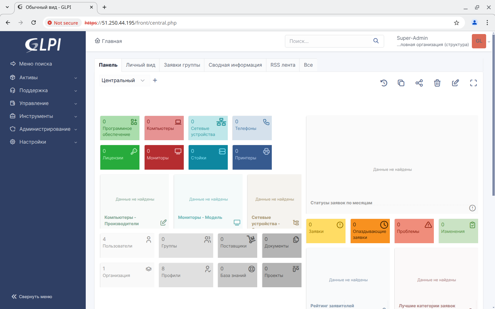
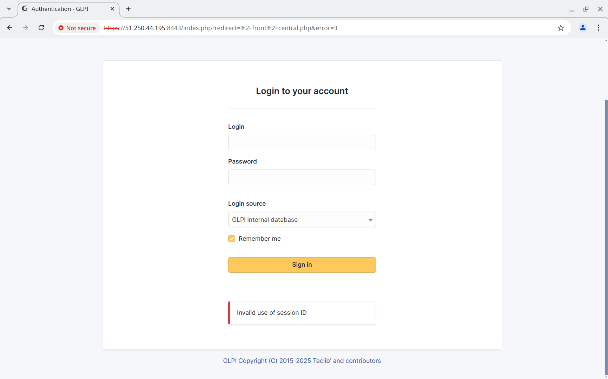
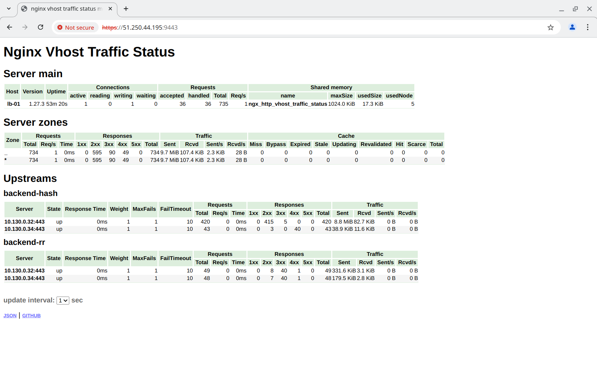

# Балансировка веб-приложения

## Задание

Развернуть 4 виртуальные машины терраформом в Яндекс.Облаке:

- Одна виртуальная машина балансировщик с публичным IP адресом. Показать конфигурацию для балансировки методами **round-robin** и **hash**.
- Две виртуальные машины **nginx frontend** со статикой и **backend** на выбор.
- Запустить виртуальную машину с одним экземпляром базы данных для работы с **backend**.

## Реализация

Скрипт для поднятиях 4-х виртуальных машин состоит из нескольких файлов:

- [terraform.tf](terraform.tf) - содержит список используемых провайдеров и их версии;
- [providers.tf](providers.tf) - содержит настройки провайдера **Yandex Cloud**;
- [variables.tf](variables.tf) - содержит описания используемых переменных;
- [outputs.tf](outputs.tf) - содержит код, возвращающий IP адреса создаваемых машин;
- [main.tf](main.tf) - содержит описания создаваемых машин.

Также написаны шаблоны:

- [cloud-config.tftpl](cloud-config.tftpl) - конфигурация **cloud init** для создаваемых машин;
- [inventory.tftpl](inventory.tftpl) - шаблон инвентартного файла `inventory.yml` для **ansible**;

Помимо этого написаны скрпипты для автоматизации запуска:

- [update-tfvars.sh](update-tfvars.sh) - генерирует SSH ключ `secrets/yandex-cloud` для подключения к машине создаёт файл секретов `terraform.tfvars` на основании переменных, указанных в скрипте:
- [provision.sh](provision.sh) - запускает `ansible-playbook provision.yml`;
- [ssh.sh](ssh.sh) - скрипт для подключения к машинам по ssh;
- [up.sh](up.sh) - выполняет все действия, необходимые для создания и настройки машины.

Реальный **IP** адрес настроен только на **frontend**, поэтому подключаться ко всем виртуальным машинам необходимо через **lb-01** (сгенерированный файл `inventory.yml` уже содержит необходимые настройки).

Файл `provision.yml` в свою очередь запускает роли:

- **angie** - устанавливает и настраивает **angie**;
- **glpi** - устанавиливает и настраивает **glpi**;
- **mariadb** - устанавиливает и настраивает **mariadb**;
- **mariadb_databases** - создаёт базы данных в **mariadb**;
- **mariadb_timezones** - заполняет таблицу **mysql.time_zone_name**, необходимую для работы **mariadb**;
- **mariadb_users** - создаёт пользователей, для подключения к **mariadb**;
- **php_fpm** - устанавиливает и настраивает **php-fpm**;
- **system_groups** - создаёт группы пользователей в системе (в частности для **glpi**);
- **system_users** - создаёт пользователей в системе (в частности для **glpi**);
- **tls_ca** - создаёт сертификаты для корневых центров сертификации;
- **tls_certs** - создаёт сертификаты для узлов;
- **tls_copy** - копирует серитификаты на узел;
- **wait_connection** - ожидает доступности машин.

Переменные для этих ролей **ansible** находятся в директории [group_vars](group_vars). В частности настройки **angie** находятся в файлах:

- [all/angie.yml](group_vars/all/angie.yml) - общие настройки для **frontend** и **backend**;
- [backend/angie.yml](group_vars/backend/angie.yml) - настройки для **backend**;
- [lb/angie.yml](group_vars/lb/angie.yml) - настройки для **frontend**.

Конфигурации для балансировки находятся в файле [lb/angie.yml](group_vars/lb/angie.yml). Переменная **angie_httpd_conf_frontend_hash** содержит конфигурацию балансировки методом **hash**, а переменная **angie_httpd_conf_frontend_rr** методом **round-robin**.

## Запуск

1. Необходимо установить и настроить утилиту **yc** по инструкции [Начало работы с интерфейсом командной строки](https://yandex.cloud/ru/docs/cli/quickstart).
2. Необходимо установить **Terraform** по инструкции [Начало работы с Terraform](https://yandex.cloud/ru/docs/tutorials/infrastructure-management/terraform-quickstart).
3. Необходимо установить **Ansible**.
4. Необходимо перейти в папку проекта и запустить скрипт [up.sh](up.sh).

Протестировано в **OpenSUSE Tumbleweed**:

- **Ansible 2.18.3**
- **Python 3.11.11**
- **Jinja2 3.1.5**

## Проверка

Подключимся на внешний IP адрес машины **lb-01** на 443 порт и выполним вход в **GLPI** (логин и пароль `glpi`):

Подключиться через upstream **backend-rr** можно по 8443 порту. Однако из-за того, что для **GLPI** не настроено общее количество сессий будет ошибка `Invalid use of session ID`:

Статистика подключения доступна по порту 9443. Видно, что все успешные подключения через upstream **backend-hash** идут через один сервер, а **backend-rr** распределяет запросы равномерно:

